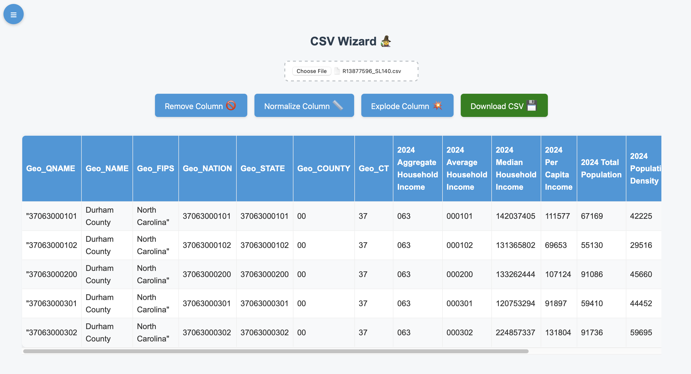
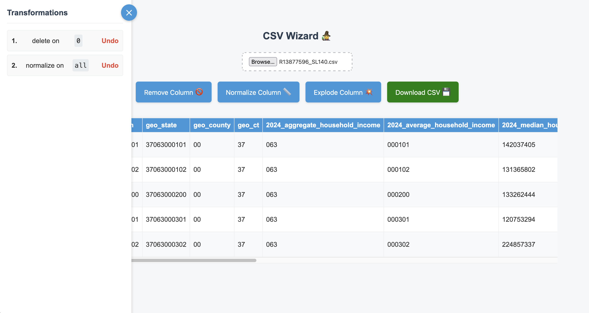

# CSV Wizard 🧙

CSV Wizard is a web application designed to help users upload, transform, and download CSV files. It provides a user-friendly interface to apply various transformations like normalizing columns, exploding data based on delimiters, and more, with a live preview of the changes.





## Features

*   **CSV Upload**: Users can upload CSV files directly through the browser.
*   **Live Preview**: View the CSV data and see changes in real-time as transformations are applied.
*   **Transformations**:
    *   Remove Column
    *   Normalize Column (e.g., trim whitespace, convert case - *implementation specific*)
    *   Explode Column (split a column into multiple rows based on a delimiter)
*   **Transformation Management**: Add and remove transformations easily. The order of transformations is maintained.
*   **Download Transformed CSV**: Download the resulting CSV file after applying all desired transformations.
*   **Collapsible Sidebar**: The list of applied transformations is displayed in a collapsible sidebar for better screen space management.
*   **State Persistence (Optional)**:
    *   The application can remember the last uploaded CSV data and applied transformations across page refreshes using browser localStorage (this feature can be toggled in the JavaScript).
    *   The sidebar's collapsed/expanded state is also persisted.
*   **Modern UI**: Sleek and responsive user interface.

## How to Run

### Prerequisites

*   [.NET SDK](https://dotnet.microsoft.com/download) (version compatible with the backend project, likely .NET 5.0 or newer)
*   A modern web browser (e.g., Chrome, Firefox, Edge)
*   `lsof` command-line utility (usually available on macOS and Linux, used by the run script to kill processes on specific ports).

### Steps

1.  **Clone the repository (if applicable) or navigate to the project directory.**
    ```bash
    git clone https://github.com/RolRodr/csvwizard.git
    ```

2.  **Make the development script executable (if needed):**
    ```bash
    chmod +x setup.sh
    ```

3.  **Run the development script:**
    This script will:
    *   Kill any existing processes on the defined backend and frontend ports.
    *   Build and start the ASP.NET Core backend (default: `http://localhost:5000`).
    *   Start a simple HTTP server for the frontend (default: `http://localhost:5173`).
    ```bash
    ./setup.sh
    ```

4.  **Open the application in your browser:**
    Navigate to the frontend URL, typically `http://localhost:5173`.

## Technologies Used

*   **Backend**:
    *   ASP.NET Core (C#)
    *   Minimal dependencies, focused on CSV processing.
*   **Frontend**:
    *   HTML5
    *   CSS3
    *   Vanilla JavaScript (ES6+)
*   **Development Script**:
    *   Bash Shell Script

## File Structure

```
CSVWizard/
├── backend/                  # ASP.NET Core backend project
│   ├── Controllers/
│   │   └── CsvController.cs  # API controller for CSV operations
│   ├── Program.cs
│   ├── Startup.cs
│   └── CSVWizard.csproj
├── assets/                   # Frontend assets
│   ├── css/
│   │   └── style.css         # Main stylesheet
│   └── js/
│       └── main.js           # Main JavaScript logic for frontend
├── index.html                # Main HTML file for the frontend
├── run-dev.sh                # Shell script to start backend and frontend
└── README.md                 # This file
```

## Notes

*   The backend API endpoints are prefixed with `/api/csv/` (e.g., `/api/csv/upload`, `/api/csv/transform`).
*   The `setup.sh` script sets the backend port to `5000` and the frontend port to `5173` by default. These can be modified in the script.

## Potential Future Enhancements

- [ ]   More sophisticated error handling
- [ ]  Additional transformation types (e.g., find/replace, conditional formatting, data type conversion).
- [ ]   Ability to reorder transformations.
- [ ]   Support for larger CSV files (streaming, background processing).
- [ ]   Unit and integration tests.
